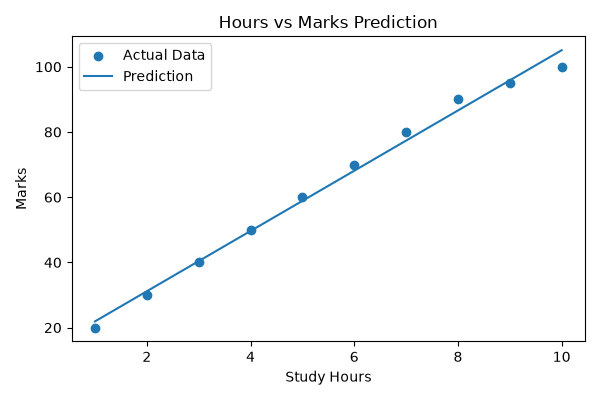

# Predictive Modeling Using Machine Learning

## Objective
Build a machine learning model to predict student marks based on study hours using Linear Regression.

## Technologies Used
- Python
- Pandas
- Matplotlib
- Scikit-learn

## Files
- student_data.csv
- predictive_model.py
- prediction_chart.png

## Output
The model predicts student marks based on study hours and generates a visualization.

